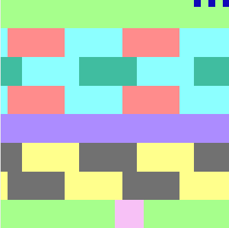
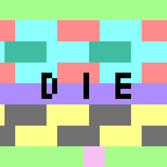

# Frogger Arcade Game

<!-- TABLE OF CONTENTS -->

  
Table of Contents

  <ol>
    <li>
      <a href="#about-the-project">About The Project</a>
      <ul>
        <li><a href="#built-with">Built With</a></li>
      </ul>
    </li>
    <li><a href="#features">Features</a></li>
    <li><a href="#how-to-play">How to Play</a></li>
    <li><a href="#contributers">Contributers</a></li>
  </ol>

<!-- ABOUT THE PROJECT -->
## About The Project
This is an implementation of the popular arcade game [Frogger](https://froggerclassic.appspot.com/). Without access to computers with MIPS processors, the game can be tested in a MIPS simulator MARS.
The goal of the game is to get a frog from the bottom of the screen to one of the safe areas at the top.

[Click here](https://drive.google.com/file/d/1b1Ota0kws-2LUt_zNOXjWTKqr9M9-Wa1/view?usp=sharing) for a demonstration of game play. 

### Built With

* [MIPS Assembly](https://en.wikipedia.org/wiki/MIPS_architecture)
* [MARS (MIPS Assembler and Runtime Simulator)](http://courses.missouristate.edu/kenvollmar/mars/)

<!-- Features -->
## Features

- [ ] 5 rows of obstacles
- [ ] colision detection
- [ ] display of number of lives
- [ ] second level of difficulty after win
- [ ] sound effects for moving, win, restart and colisions
- [ ] death animation
- [ ] game over/restart screen

(<a href="#top">back to top</a>)

## How to Play

1. Start the Mars4_5.jar file
2. Inside the simulator, open the following from the 'Tools' tab
    - Bitmap Display
    - Keyboard and Display MMIO Simulator
3. In the Bitmap Display, use the following configurations
    - Unit Width/Height: 8
    - Display Width/Height: 256
    - Base address for display: 0x10008000 ($gp)
4. Connect both to MIPS and run the program
5. Use 'w', 'd', 's' and 'a' keys to play the game

(<a href="#top">back to top</a>)

<!-- CONTRIBUTERS -->
## Contributers
- Raazia Hashim

 [CSC258 - Computer Organization](https://artsci.calendar.utoronto.ca/course/csc258h1)

(<a href="#top">back to top</a>)

